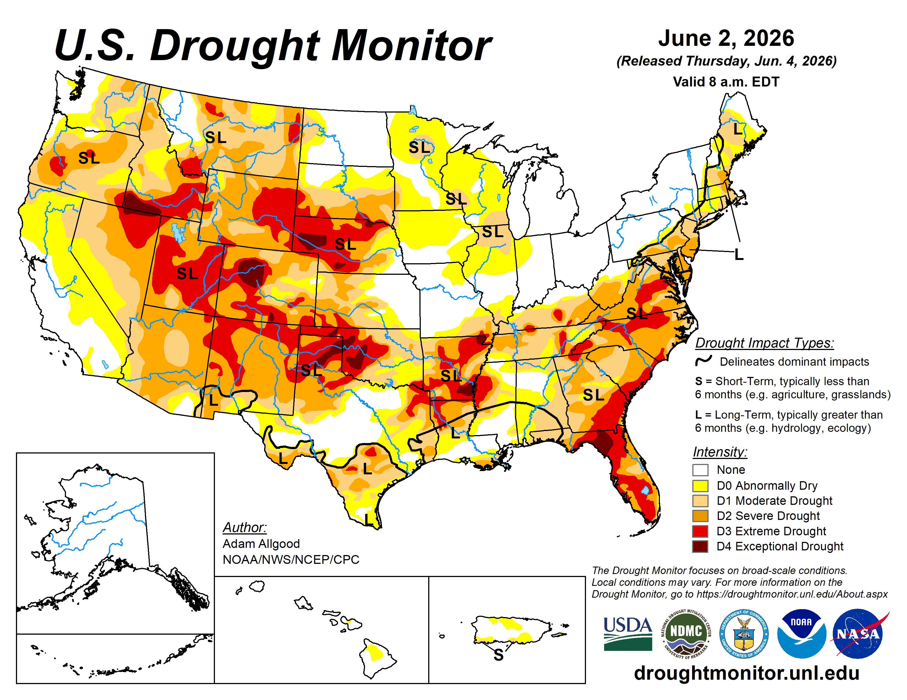
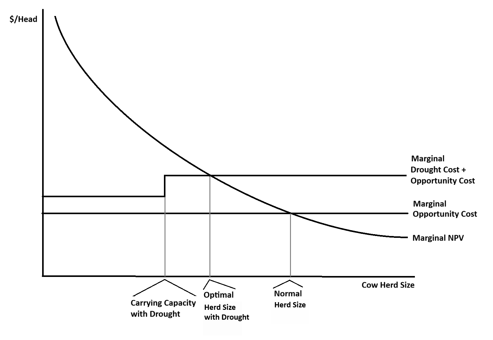

Drought is an issue that Western ranchers are familiar with. While it is difficult to predict *when* drought will occur, it is certain that it *will happen* if you are in business for any significant amount of time. This year, 2026, happens to be one of those years in Utah. And for that matter, much of the rest of the country as shown in a recent US Drought Monitor map.

Managing during a drought means making important decisions about stocking rates, culling, feeding, and/or renting pasture. The first and most impactful decision is determining the drought-reduced carrying capacity of your existing forage base. This should be done with the goal to do no permanent damage to the ranch resources. When this determination is made, the next step is to determine the lowest cost (but still nutritionally acceptable) way to maintain the current herd size of the ranch. At this point you are now ready to answer the main question: **should I reduce my herd?**. There's no universal right answer---it depends on your specific costs (especially hay/pasture rental), the cattle market, and the age demographics of your herd. 

In this post, I am sharing a decision framework based on economic principles that I have developed along with my USU colleagues Ryan Larsen and David Secrist. We have also developed a decision tool that follows this framework, available at: [farmanalysis.usu.edu](https://farmanalysis.usu.edu). 

## A Cow Is a Capital Asset

It is useful to think of your ranch as a factory and your cows as calf-producing machines within the factory. Using this analogy, both the ranch and the breeding stock are capital assets, something that you invest in for the promise of value creation for years to come. In this way of thinking, a cow has value based on what she's expected to produce over her remaining lifespan. 

Economists call this **net present value**, or NPV. The NPV of a cow is the total expected profit from her future calves---discounted back to today's dollars---plus whatever she'll be worth when you eventually sell her as a cull. It depends on:

- Expected calf prices
- How much her calves weigh at weaning
- The probability she actually weans a calf (pregnancy rate × calving rate × survival)
- The annual cost of keeping her (feed, vet, labor, breeding)
- Cull value at the end of her productive life (adjusted for the possibility of premature death)

It is important to note that every cow's NPV is different. A 5-year-old has a higher NPV than a 12-year-old because of (1) more expected calves, and (2) higher reproductive efficiency. However, we typically don't have enough data to calculate individual animal NPVs, but a reasonable alternative is calculating NPV by age to help with our decision.

## A Decision Rule (Normal Year)

In a normal year, the culling decision comes down to a comparison:

> **Retain if:** the cow's NPV > her current market cull value - excess replacement cost.

The left-hand side of the decision equation is the benefit of keeping the cow, while the right-hand side is the opportunity cost of that action. Economics always asks us to compare the benefits with the costs. 

An opportunity cost is the value of the alternative we give up when making a choice. In this case, when we retain a cow, we cannot sell her in the cull market, so we forgo that potential revenue. There is also an adjustment for "excess replacement cost" because we will need to replace a cull to remain at a steady-state in terms of herd size. If we can purchase (or raise) a replacement at a price equal to *their NPV*, then this is not an issue. But if we have to pay a replacement cost above that animals expected NPV, then we need to factor this into the culling decision.

## Decision Rule Under Drought Conditions

Drought doesn't change the economic logic, it just adds costs.

There are two types of costs that are worth thinking about separately. First, **herd-wide drought costs**: higher hay prices, hauled water, extra labor. These apply to every cow in the herd whether the ranch is overstocked or not. Second, **over-capacity costs**: once you're running more cows than the drought-reduced carrying capacity then you are buying supplemental feed for every animal above that reduced carrying capacity.

The decision equation in a drought year becomes:

> **Retain if:** the cow's NPV - *drought costs* > her current market cull value - excess replacement cost.

This is the same comparison as before, except drought costs are now reducing the benefit side of the equation (you could also add the costs to the cost side). A cow who was worth keeping in a normal year may not be worth keeping with the additional drought costs.

## Thinking on the Margin

In addition to comparing costs and benefits, economics encourages us to "think on the margin". The reason is that (under certain assumptions) evaluating the marginal cost and marginal benefit leads to profit maximizing decisions. But what does it mean to think on the margin? Well, "the margin" literally means the edge or border of something. In this case the margins of our herd.

To do this, we need to define the margin of the herd by *ordering* the cattle from the most to least valuable. The most valuable cattle come first, because they are the least likely to be culled. The ordering is important because it also allows us to apply costs to the correct cattle as well. For example, when the drought-reduced carrying capacity of the ranch is reached, the additional cost is applied to cattle over the threshold. And the cattle over the threshold are the least valuable cattle because of our ordering.

## Bringing it Together Visually

There are few things economists love more than graphs because they can be effective in communicating abstract ideas. The concepts previously discussed are all brought together in the following graph.

Here's how to read it:

**The Marginal NPV curve** this curve is downward sloping because we determined to order our herd by value, so that we cull the least valuable animals first.

**The Marginal Opportunity Cost** (the lower flat line) is the value of the animal in the cull market, or the revenue you give up by retaining her. It also includes the adjustment for excess replacement costs. In a normal year, you retain cows with NPVs that exceed this threshold, which gives you the **Normal Herd Size** on the right side of the x-axis.

**The Marginal Drought Cost + Opportunity Cost** (the upper flat line) is the drought-adjusted opportunity cost. Once the herd exceeds the **Carrying Capacity with Drought** (the first vertical line), you must purchase feed/pasture for every additional cow. We apply the per head costs only to the cows over the carrying capacity because they are *causing* the costs. This is what it means to "think on the margin". In a drought year, the intersection of this line with the marginal NPV curve gives **The Optimal Herd Size with Drought**. 

Depending where the lines fall, the best decision could be to sell cows, feed cows (or rent pasture), or a combination of these options. It depends on your operational specifics and the current and future cattle market.

## Conclusion

If your drought situation is forcing you into the decision whether to sell cows or purchase hay, consider the economic principles in this post. We have also created a decision tool based on this framework to help you with the math for your operation. You can access it at: [farmanalysis.usu.edu](https://farmanalysis.usu.edu).

One thing to consider is that at current (and likely future) market prices, cattle NPVs are currently relatively high. This may make purchasing hay surprisingly worthwhile. It is certainly worth considering the options before reducing your herd. 

---

*Questions and feedback welcome at [a.anderson\@usu.edu](mailto:a.anderson@usu.edu). For more tools and resources, visit [farmanalysis.usu.edu](https://farmanalysis.usu.edu).*
