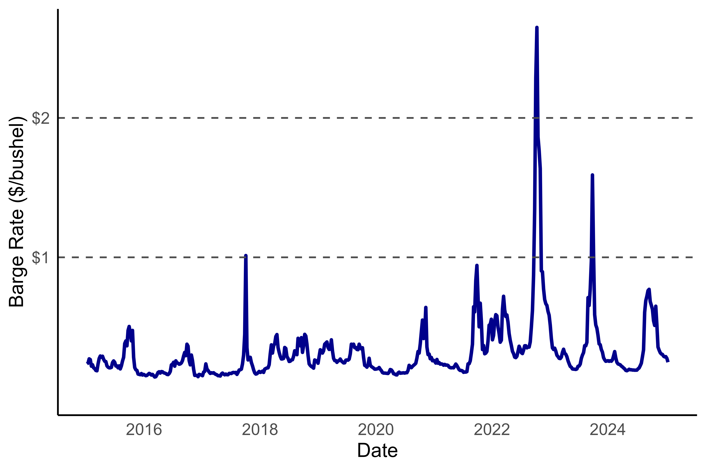
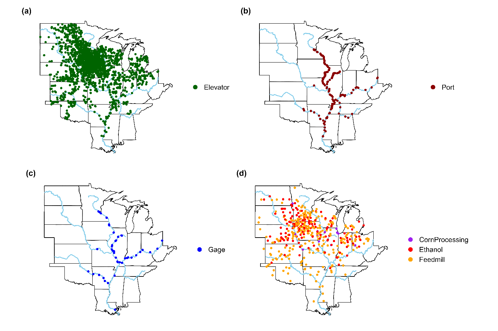
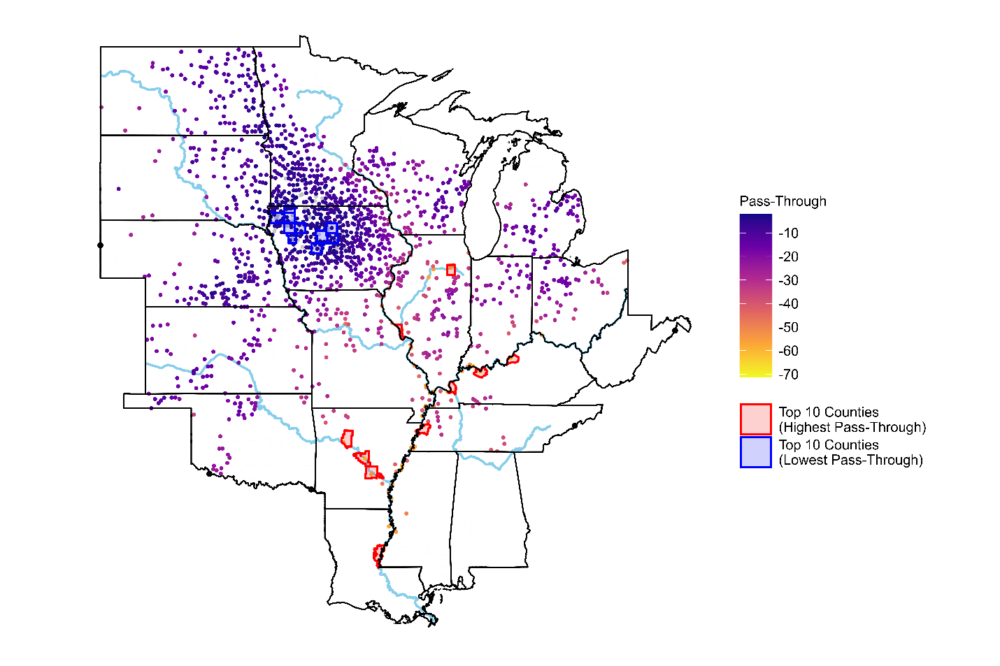

My coauthors at the University of Arkansas and I recently published a paper in *Agribusiness* on how transportation cost shocks along the Mississippi River system affect corn and soybean basis (full article: [https://doi.org/10.1002/agr.70108](https://doi.org/10.1002/agr.70108)). Here is the abstract:

> A substantial share of U.S. soybean and corn exports from the Midwest moves by barge along the Mississippi River system to export terminals in the Louisiana Gulf. Transportation costs between Midwestern grain elevators and export terminals create a wedge between prices at these locations, and shocks to these costs are partially passed on to farmers through lower cash bids and weaker basis. We estimate the pass-through rate of river transportation cost shocks to farmers using elevator-level cash bids and barge freight rates in a fixed-effects instrumental variables model, with river levels serving as an instrument. We also examine interaction effects for distance to a river port, distance to a processing plant, and the density of nearby elevators. Results indicate that higher river transportation costs weaken soybean and corn basis. The negative effect is smaller for elevators located farther from a river port or in areas with more nearby elevators, while distance to a processing plant plays a limited role in mitigating barge rates being passed through to basis. Pass-through for corn is more strongly moderated by local elevator density, whereas pass-through for soybeans is more sensitive to distance from a river port. These findings help farmers assess their exposure to basis risk from river transportation disruptions. Our results also provide policymakers with an empirical measure of the cost of such disruptions on farmers, informing the valuation of infrastructure investments that mitigate them.

The work was motivated by historically low river levels late in the year — close to harvest time — over the last several years, which drove historically high barge freight rates (Figure 1).

**Figure 1.** Barge freight rates measured in USD per bushel of soybeans from Memphis, Tennessee.

Because river levels affect barge rates and are plausibly exogenous, we used them as an instrument to identify the relationship between barge rates and corn and soybean basis. River transportation costs do not affect every location the same way, though. We thought of a few reasons that farmers selling to a given elevator might be more or less exposed: proximity to a river port, proximity to alternative marketing options (ethanol plants, soy crush facilities, feed mills, etc.), and the density of nearby grain buyers (more competition for grain limits how much of the cost can be passed on). Figure 2 from the paper maps these features for corn.

**Figure 2.** Geographic distribution of corn elevators, river ports, gage sites, and processing plants within the Mississippi River Basin.

We found that pass-through of barge rates does indeed vary across these dimensions. The most intuitive result is that proximity to a river port increases the share of the cost passed on to farmers. Elevators located near processing plants that absorb local grain supply are more insulated from barge rate shocks. And greater spatial competition among grain buyers also limits pass-through. Figure 4 from the paper shows where the strongest (most negative) and weakest (least negative) impacts fall across the Mississippi River Basin.

**Figure 4.** Spatial distribution of marginal effects of barge freight rates on grain basis for corn. More negative values indicate stronger pass-through (e.g., a marginal pass-through of −0.35 means a $1 barge rate increase weakens basis by 35 cents). For corn, Iowa and southern Minnesota show weak pass-through due to competitive grain buying and abundant processing capacity, while the lower Mississippi shows strong pass-through due to limited competition and proximity to river ports.

What does this mean for real-life decision making? The most important implication is that river disruptions don't just move the overall price level for commodities — reflected in the futures market — they also change basis. That distinction matters because basis risk is not easily hedged like general price risk. So determining your level of exposure to this risk is the first step in managing it.

The conclusion of the paper summarizes the implications this way:

> Our findings highlight several implications. For producers, the results map shows where exposure to transportation disruptions is greatest. Strategies such as diversifying marketing and investment in storage capacity can help manage this source of basis risk. For policymakers, these results show the value to farmers of reliable river navigation. This value should be considered in the benefits of infrastructure investments to reduce navigation disruptions. Moreover, the role of competitive local grain buying markets in moderating cost transmission should be considered in merger review and rural development policy.

Check out the full article if you want more details on the background, methods, results, or implications! 
